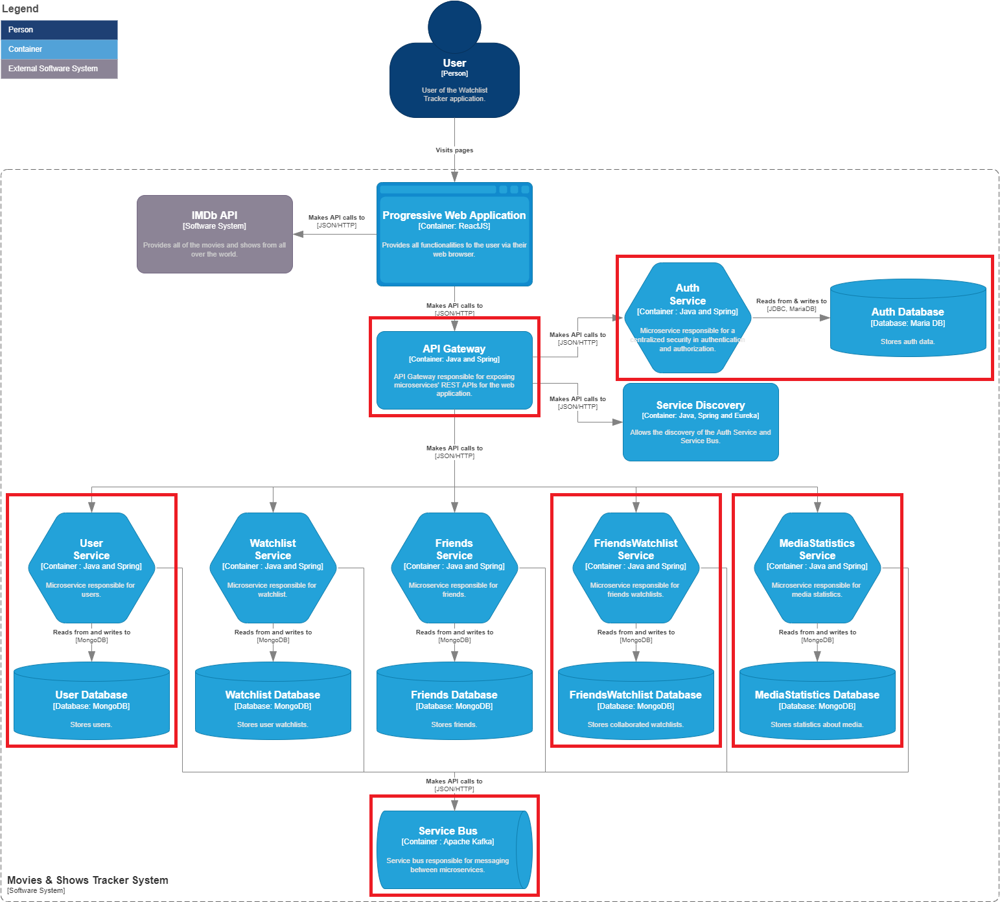

# About the project

## Follow the planning
https://github.com/orgs/SEM6-WatchlistTracker/projects/1

## Focus of the project

_(See the image below.)_

The chosen APIs are:
- [Gateway](https://github.com/SEM6-WatchlistTracker/wlt-gateway)
- [Auth Service](https://github.com/SEM6-WatchlistTracker/wlt-auth-service)
- [User Service](https://github.com/SEM6-WatchlistTracker/wlt-user-service)
- [FriendsWatchlist Service](https://github.com/SEM6-WatchlistTracker/wlt-friendswatchlist-service)
- [MediaStatistics Service](https://github.com/SEM6-WatchlistTracker/wlt-mediastatistics-service)
- [Kafka Messaging Bus](https://github.com/SEM6-WatchlistTracker/wlt-kafka-messaging)
- _[Service discovery](https://github.com/SEM6-WatchlistTracker/wlt-discovery) (completed)_

These were chosen because:

- Gateway & Auth Service for security learning outcomes.
- A combination of User, FriendsWatchlist and MediaStatistics to show messaging and other communication between services. E.g. FriendsWatchlist needs User data.
- FriendsWatchlist and MediaStatistics for Real-Time data.

